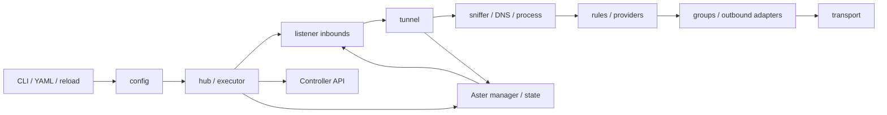

<p align="center">
  
</p>

<h1 align="center">Aster Core</h1>

<p align="center">
  相容 Mihomo、並提供 VLESS 與 AnyTLS 即時使用者管理的通用代理核心。
</p>

<p align="center">
  <a href="README.md">English</a> · <strong>繁體中文</strong> · <a href="docs/index.md">完整文件</a>
</p>

<p align="center">
  <a href="https://github.com/Miku0139oao/aster-core/actions/workflows/test.yml">
    
  </a>
  <a href="https://goreportcard.com/report/github.com/Miku0139oao/aster-core">
    
  </a>
  
  <a href="https://github.com/Miku0139oao/aster-core/releases">
    
  </a>
  <a href="LICENSE">
    
  </a>
</p>

Aster Core 是以 [MetaCubeX/mihomo](https://github.com/MetaCubeX/mihomo) 為基礎的安全強化分支。它保留 Mihomo YAML 設定格式與 Clash 相容 Controller API，並新增可選用的管理平面，用於即時更新 VLESS、AnyTLS 使用者、逐使用者流量統計、狀態持久化與訂閱連結。

目前的上游基線是 Mihomo `v1.19.29`，commit `e26714a181ac0e2fa803453c0a8e9a9ce94e31cb`。來源、授權及同步政策請參閱 [NOTICE.md](NOTICE.md) 與 [UPSTREAM.md](UPSTREAM.md)。

> [!IMPORTANT]
> Aster Core 接受 Mihomo 設定，不直接接受 sing-box 或 Xray 設定。它以維持 Mihomo 與 Clash API 相容性為目標，但仍須留意 Aster 自有功能及本文列出的相容性限制。

## 目錄

- [主要特色](#主要特色)
- [與 Mihomo 的差異](#與-mihomo-的差異)
- [支援能力](#支援能力)
- [文件站](#文件站)
- [快速開始](#快速開始)
- [設定](#設定)
- [Aster 使用者管理](#aster-使用者管理)
- [部署](#部署)
- [命令列參考](#命令列參考)
- [架構](#架構)
- [開發](#開發)
- [相容性與操作注意事項](#相容性與操作注意事項)
- [授權與致謝](#授權與致謝)

## 主要特色

- 相容 Mihomo YAML、規則引擎、代理提供者、規則提供者與 Clash REST API。
- 支援 HTTP、SOCKS5、Mixed、透明代理、TUN 及多種協定伺服器入站。
- 支援 VLESS/XHTTP、VMess、Shadowsocks、Trojan、AnyTLS、Hysteria、TUIC、WireGuard、OpenVPN、Tailscale 等出站。
- 內建 DNS 伺服器，包含 fake-IP、hosts、策略路由、快取及 DoH/DoT/DoQ/DHCP 上游。
- 提供 `select`、`url-test`、`fallback`、`load-balance` 代理群組與健康檢查。
- 可依網域、GeoIP、GeoSite、IP/CIDR、ASN、程序、連接埠、入站、使用者、網路類型及邏輯條件分流。
- 不重建 listener 即可即時新增、修改、停用或刪除 VLESS 與 AnyTLS 使用者。
- 逐入站、逐使用者記錄上傳、下載與活動連線。
- Aster 狀態具備檔案鎖、generation 衝突檢查、備援檔及嚴格權限。
- 提供 Linux、Windows、macOS、Android、FreeBSD 建置目標及 OpenWrt/Nikki 整合。

## 與 Mihomo 的差異

Aster Core 不是重新開發的代理核心。協定堆疊、設定模型、規則引擎、DNS、providers、TUN 與 Clash API 均建立在 Mihomo `v1.19.29` 之上。Aster 主要新增的是運維與管理層：

| 項目 | Mihomo 基線 | Aster 新增 |
| --- | --- | --- |
| 專案識別 | `mihomo` module 與發行名稱 | 獨立 `aster-core` module、binary、套件、映像與來源政策 |
| 受管入站 | 使用者主要寫在 YAML，變更通常依賴重新載入設定 | 對具名 VLESS、AnyTLS listener 提供即時使用者 CRUD |
| 管理 API | Clash 相容 Controller API | 獨立 `/api/admin` API 與強制 Aster Bearer token |
| 併發控制 | 設定層更新 | 每個 listener 有 revision；過期寫入回傳 HTTP 409 |
| 流量統計 | 全域與連線層統計 | 持久化逐入站、逐使用者上下行流量與活動連線 |
| 持久化 | 執行設定與 profile cache | 具鎖定、generation、原子替換、`.bak` 備援的 Aster JSON store |
| 訂閱 | 一般 provider/profile 機制 | 可輪替 token 的單一使用者 `/sub/aster/{token}` |
| 安全邊界 | Controller `secret` | 獨立至少 32 bytes 的 Aster secret、same-origin、明文 loopback 限制、body 上限及檔案權限檢查 |
| 管理效能 | 上游資料結構 | 索引化使用者查找、listener 定向複製、批次流量寫回與憑證更新生命週期處理 |
| 發行整合 | Mihomo 上游產物 | Aster 原生發行，並為 Linux 套件與 OpenWrt/Nikki 保留 `/usr/bin/mihomo` 相容入口 |
| 品質檢查 | 上游 CI | Aster 管理、持久化、生命週期、效能、race、lint 與互通測試 |

Aster 管理目前只支援 VLESS 與 AnyTLS。下方其他協定是繼承自 Mihomo，不能透過 Aster Admin API 自動管理。完整邊界與遷移影響請參閱[「Aster 與 Mihomo 差異」](docs/reference/mihomo-differences.md)。

## 支援能力

| 類別 | 內容 |
| --- | --- |
| 本機與透明入站 | HTTP、SOCKS5、Mixed、Tunnel、TUN、Redir、TProxy |
| 協定入站 | Shadowsocks、Snell、VMess、VLESS、Trojan、Hysteria 2、Hysteria 2 Realm、TUIC、ShadowQUIC、AnyTLS、Mieru、Sudoku、TrustTunnel |
| 出站 | Shadowsocks、ShadowsocksR、SOCKS5、HTTP、VMess、VLESS、Snell、Trojan、Hysteria 1/2、WireGuard、TUIC、ShadowQUIC、SSH、Mieru、AnyTLS、Sudoku、MASQUE、TrustTunnel、OpenVPN、Tailscale、Gost Relay |
| 內建出站 | `DIRECT`、`REJECT`、`DNS`、`REMATCH` |
| 代理群組 | `select`、`url-test`、`fallback`、`load-balance` |
| DNS | UDP/TCP DNS、DoH、DoT、DoQ、DHCP、fake-IP、fallback、nameserver policy、hosts、cache |
| Controller | HTTP、HTTPS、Unix socket、Windows named pipe |
| 路由輸入 | 網域、suffix、keyword、regex、wildcard、GeoIP、GeoSite、IP/CIDR、IP suffix、ASN、程序、UID、連接埠、DSCP、入站、網路類型、rule set、邏輯規則 |

完整設定範例位於 [docs/config.yaml](docs/config.yaml)，敘述式參考文件請從[文件首頁](docs/index.md)開始。

## 文件站

Repository 的 [`docs/`](docs/index.md) 已擴充成可全文搜尋的繁體中文 VitePress 文件站，並清楚區分 Mihomo 繼承行為與 Aster 自有變動。內容包含設定、入站、出站、規則、DNS、Aster API、安全、部署、架構、測試與疑難排解。

```sh
cd docs
npm ci
npm run dev
```

正式建置使用 `npm run build`。原本完整註解的 YAML 仍保留在 [`docs/config.yaml`](docs/config.yaml)。

## 快速開始

### 1. 安裝

可從 [GitHub Releases](https://github.com/Miku0139oao/aster-core/releases) 下載 binary 或原生套件，也可自行建置：

```sh
git clone https://github.com/Miku0139oao/aster-core.git
cd aster-core
go mod download
mkdir -p bin
CGO_ENABLED=0 go build -tags with_gvisor -trimpath -o bin/aster-core .
```

最低需要 Go 1.20。正式發行使用 `with_gvisor` tag；需要 TUN 或 Tailscale 時，請使用相同 tag。

### 2. 建立最小設定

建立 `config/config.yaml`：

```yaml
mixed-port: 7890
allow-lan: false
mode: rule
log-level: info

external-controller: 127.0.0.1:9090
secret: "replace-this-controller-secret"

dns:
  enable: true
  enhanced-mode: fake-ip
  nameserver:
    - system

rules:
  - MATCH,DIRECT
```

此設定會在 `127.0.0.1:7890` 啟動 HTTP/SOCKS Mixed 代理，在 `127.0.0.1:9090` 啟動 Controller，並將流量直接送出。實際使用前請加入代理、群組與路由規則。

### 3. 驗證並啟動

```sh
./bin/aster-core -d ./config -f ./config/config.yaml -t
./bin/aster-core -d ./config -f ./config/config.yaml
```

Windows 請使用 `.\bin\aster-core.exe`。Unix 可傳送 `SIGHUP`，在不中止程序的情況下重新讀取檔案型設定。

## 設定

未指定 `-d` 或 `-f` 時，預設路徑如下：

| 平台 | 預設設定檔 |
| --- | --- |
| Linux、macOS 及其他 Unix | `$HOME/.config/mihomo/config.yaml` |
| Windows | `%USERPROFILE%\.config\mihomo\config.yaml` |

找不到預設檔案時，Aster Core 會建立只包含 `mixed-port: 7890` 的初始設定。相關資產、快取、providers 與預設 Aster state 都位於相同 home directory。

設定來源：

```sh
# 指定檔案
aster-core -d /etc/mihomo -f /etc/mihomo/config.yaml

# 標準輸入
aster-core -d /etc/mihomo -f - < /etc/mihomo/config.yaml

# Base64 YAML
aster-core --config '<base64-data>'

# 預設路徑
aster-core
```

相對 `-d`、`-f` 都以目前工作目錄解析；相對 `-f` 不會以 `-d` 目錄為基準。Age armored 設定可透過 `--age-secret-key` 或 `CLASH_AGE_SECRET_KEY` 解密。

設定引用的路徑預設只能位於 home directory。可用 `SAFE_PATHS` 增加可信根目錄；`SKIP_SAFE_PATH_CHECK=true` 會完全停用保護，只應用於受控環境。

### Dashboard 與 Controller

標準 Clash API 提供設定、代理、群組、規則、連線、providers、DNS、cache、storage、logs、traffic、memory、restart 與 upgrade。請設定非空白 Controller `secret`，不要直接把明文 Controller 暴露到不可信網路。

可使用 [metacubexd](https://github.com/MetaCubeX/metacubexd) 作為標準 Controller Dashboard。`/ui` 靜態頁面、Aster 訂閱及可選的 Controller DoH 路由不在一般 Controller authentication group 內，設計 firewall 或 reverse proxy 時需分開保護。

## Aster 使用者管理

Aster 管理是選用功能，目前支援 `listeners` 內具名的 VLESS 與 AnyTLS。使用者變更會持久化並即時套用，不需重建 listener。

```yaml
external-controller: 127.0.0.1:9090
secret: "replace-this-controller-secret"

listeners:
  - name: edge-vless
    type: vless
    listen: 0.0.0.0
    port: 8443
    users: []
    certificate: ./server.crt
    private-key: ./server.key

aster:
  secret: "replace-with-a-random-aster-secret-of-32-bytes"
  public-base-url: "https://proxy.example.com"
  store: "aster-state.json"
  managed-listeners:
    - edge-vless

rules:
  - MATCH,DIRECT
```

`public-base-url` 必須是絕對 HTTPS URL，且不能包含 user info、query 或 fragment。其 hostname 會用於產生代理連結，連接埠則取自實際 listener。需要訂閱時，請在該 HTTPS origin 發布 `/sub/aster/*`。

Aster secret 與 Controller secret 不同。Admin request 使用：

```http
Authorization: Bearer <aster-secret>
```

### API

| 方法與路徑 | 用途 |
| --- | --- |
| `GET /api/admin/overview` | 執行狀態、平台、流量、連線、使用者與入站摘要 |
| `GET /api/admin/status` | Overview alias |
| `GET /api/admin/protocols` | 可管理協定能力 |
| `GET /api/admin/inbounds` | 受管 listener 及 revision |
| `GET /api/admin/listeners` | Inbounds alias |
| `GET /api/admin/users?inbound=<name>` | 列出使用者，可依入站篩選 |
| `POST /api/admin/users` | 建立使用者 |
| `GET /api/admin/users/{id}` | 取得單一使用者、憑證及訂閱 URL |
| `PUT /api/admin/users/{id}` | 更新憑證、flow、名稱或啟用狀態 |
| `DELETE /api/admin/users/{id}?revision=<revision>` | 刪除使用者 |
| `POST /api/admin/users/{id}/reset-traffic` | 重設流量 |
| `POST /api/admin/users/{id}/rotate-subscription` | 輪替訂閱 token |
| `GET /sub/aster/{token}` | 回傳 Base64 單一使用者代理連結 |

所有 mutation 都採 optimistic concurrency。先取得目前 listener `revision`，再放入 JSON body；刪除則用 query parameter。過期 revision 會得到 HTTP `409 Conflict`。

### 安全與限制

- Aster secret 至少 32 bytes，不能有前後空白。
- Admin API 同時檢查 Bearer token 與 same-origin，request body 上限 1 MiB。
- 明文 TCP Controller 只有綁定 loopback 時才掛載 Admin API；HTTPS、Unix socket、Windows named pipe 可正常掛載。
- 訂閱以不可預測 token 驗證，不使用 Controller 或 Aster Bearer token，並回傳 `Cache-Control: no-store`。
- State file 是包含憑證與訂閱 token 的明文 JSON；Unix 使用 owner-only 目錄與 `0600`，Windows 套用對應 ACL。
- 只有符合條件的 VLESS、AnyTLS 可產生訂閱。ShadowTLS、ResTLS、JLS 及進階 XHTTP 選項不會輸出。
- 目前 API 不支援 quota 與 expiration。

## 部署

### Docker

```sh
docker run -d \
  --name aster-core \
  --restart unless-stopped \
  --network host \
  --cap-add NET_ADMIN \
  --device /dev/net/tun \
  -v "$PWD/config:/root/.config/mihomo" \
  miku0139oao/aster-core:latest
```

掛載目錄必須包含 `config.yaml`。一般 HTTP/SOCKS 不需要 `NET_ADMIN` 或 `/dev/net/tun`。使用 `-p` 時要設定 `allow-lan: true`，否則代理只會綁定容器 loopback。

Dockerfile 使用預先建置的 `bin/*.gz`，不是從原始碼開始編譯的 Dockerfile。

### Nix

```sh
nix build .#
./result/bin/aster-core -v
```

### Linux 套件

發行流程會建立 `.deb`、`.rpm`、`.pkg.tar.zst` 與 systemd units。預設服務執行：

```text
/usr/bin/aster-core -d /etc/mihomo
```

### OpenWrt 與 Nikki

[openwrt/aster-core](openwrt/aster-core) 提供 virtual `mihomo` package 及 Nikki 需要的 `/usr/bin/mihomo` 相容路徑。詳情請參閱 [openwrt/README.md](openwrt/README.md)。

## 命令列參考

| Flag | 環境變數 | 說明 |
| --- | --- | --- |
| `-d <dir>` | `CLASH_HOME_DIR` | 設定與資料目錄 |
| `-f <file>` | `CLASH_CONFIG_FILE` | 設定檔；`-` 代表 stdin |
| `--config <base64>` | `CLASH_CONFIG_STRING` | Base64 設定 |
| `--age-secret-key <key>` | `CLASH_AGE_SECRET_KEY` | 解密 age armored 設定 |
| `--ext-ui <dir>` | `CLASH_OVERRIDE_EXTERNAL_UI_DIR` | 覆寫外部 UI 目錄 |
| `--ext-ctl <addr>` | `CLASH_OVERRIDE_EXTERNAL_CONTROLLER` | 覆寫 HTTP Controller |
| `--ext-ctl-tls <addr>` | `CLASH_OVERRIDE_EXTERNAL_CONTROLLER_TLS` | 覆寫 HTTPS Controller |
| `--ext-ctl-unix <path>` | `CLASH_OVERRIDE_EXTERNAL_CONTROLLER_UNIX` | 覆寫 Unix socket |
| `--ext-ctl-pipe <path>` | `CLASH_OVERRIDE_EXTERNAL_CONTROLLER_PIPE` | 覆寫 Windows named pipe |
| `--ext-ctl-routing-mark <mark>` | `CLASH_OVERRIDE_EXTERNAL_CONTROLLER_ROUTING_MARK` | Linux Controller socket routing mark |
| `--secret <secret>` | `CLASH_OVERRIDE_SECRET` | 覆寫一般 Controller secret |
| `--post-up <command>` | `CLASH_POST_UP` | 啟動後執行 shell |
| `--post-down <command>` | `CLASH_POST_DOWN` | 結束時執行 shell |
| `-m` | — | 啟用 geodata mode |
| `-t` | — | 驗證設定後離開 |
| `-v` | — | 顯示版本、平台、Go、建置時間與 tags |

`--post-up`、`--post-down` 會透過系統 shell 執行，不可放入不可信輸入。

```sh
aster-core generate uuid
aster-core generate reality-keypair
aster-core generate wg-keypair
aster-core generate ech-keypair example.com
aster-core generate vless-mlkem768
aster-core generate vless-x25519
aster-core generate sudoku-keypair

aster-core age keygen
aster-core age keygen-pq
aster-core age convert <secret-key>
aster-core age encrypt <public-key> <source> <target>
aster-core age decrypt <secret-key> <source> <target>

aster-core convert-ruleset <behavior> <format> <source> <target>
```

## 架構



| 路徑 | 職責 |
| --- | --- |
| `main.go` | CLI、設定來源、程序生命週期、signals |
| `config/` | 預設值、YAML、驗證、runtime config |
| `hub/` | 套用設定與 Controller server |
| `listener/` | 本機、透明、TUN、協定 server 入站 |
| `tunnel/` | TCP/UDP data plane、metadata、規則與連線追蹤 |
| `adapter/` | 出站、代理群組與代理 providers |
| `rules/` | 路由規則與 rule providers |
| `dns/` | DNS server、clients、policy、cache、fake-IP |
| `transport/` | 協定、加密、mux、obfuscation |
| `component/aster/` | 使用者、訂閱、流量與持久化 |
| `test/` | Docker 互通測試 |
| `openwrt/` | OpenWrt 與 Nikki 整合 |

## 開發

```sh
# 快速本機建置
go build -o aster-core .

# 接近正式發行
CGO_ENABLED=0 go build -tags with_gvisor -trimpath -o aster-core .

# 根 module 測試
SKIP_INTEROP_TEST=1 go test ./... -count=1
SKIP_INTEROP_TEST=1 go test ./... -count=1 -tags with_gvisor

# lint
golangci-lint run --timeout=10m
```

`test/` 是獨立 Go module，不包含在根目錄 `go test ./...`，需要 Docker：

```sh
cd test
make test
```

## 相容性與操作注意事項

- 不支援 `type: relay` 代理群組，請改用 `dialer-proxy` chain。
- 正式發行包含 `with_gvisor`；單純 `go build` 的 TUN、Tailscale 能力不同。
- TProxy UDP、自動 iptables、socket routing mark 主要限 Linux；Redir 依平台而異。
- 自動 iptables 與 TUN 不能同時啟用。
- TUN、TProxy、Redir、低連接埠及系統路由可能需要 root 或 capabilities。
- `-v` 刻意保留 `Mihomo Meta` 前綴，供 Nikki 相容性偵測。
- 檔案設定可由 `SIGHUP` 重新讀取；stdin、Base64 只會重新套用啟動時資料。
- Controller `secret` 空白時不驗證；請綁 loopback 或設定強 secret。
- Aster Admin 即使在一般 Controller 未驗證時，仍需要自己的 token。
- Rule mode 沒有命中時會回落 `DIRECT`，正式設定應包含明確 final rule。

## 授權與致謝

Aster Core 以 [GNU General Public License v3.0](LICENSE) 發布，既有上游與第三方 notices 仍有效。

主要上游專案：

- [MetaCubeX/mihomo](https://github.com/MetaCubeX/mihomo)
- [Dreamacro/clash](https://github.com/Dreamacro/clash)
- [SagerNet/sing-box](https://github.com/SagerNet/sing-box)
- [XTLS/Xray-core](https://github.com/XTLS/Xray-core)
- [WireGuard/wireguard-go](https://github.com/WireGuard/wireguard-go)
- [riobard/go-shadowsocks2](https://github.com/riobard/go-shadowsocks2)
