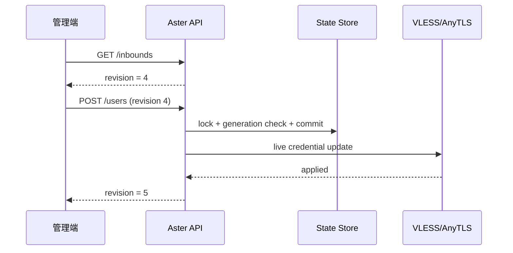

# Aster 管理功能概覽

::: tip 端到端操作
要實際完成 secret、state、managed listener、CRUD、409 conflict、訂閱輪替與備份，請使用[即時管理使用者與訂閱](/tutorials/user-management)。
:::

## 解決的問題

傳統 Mihomo server listener 把使用者寫在 YAML。要變更 credentials，通常需要修改設定並重新載入整個 runtime。Aster 管理層把 VLESS 與 AnyTLS 使用者抽成可持久化、可即時更新的資源，同時保留 Mihomo 原有資料平面。協定層的主要例外是 Aster 另行新增的 [AnyTLS + REALITY](/reference/anytls-reality)。

Aster 提供：

- 具名 managed listeners。
- User create/read/update/delete。
- Enable/disable。
- Per-listener revision。
- Per-user traffic 與 active connections。
- Subscription URL 與 token rotation。
- 安全 state store。
- 獨立於 Clash Controller 的 authentication。

## 啟用條件

需要三個部分：

1. 至少一個具名 VLESS 或 AnyTLS listener。
2. `aster` block。
3. 可存取該 API 的 Controller transport。

```yaml
external-controller: 127.0.0.1:9090
secret: "controller-secret"

listeners:
  - name: edge-vless
    type: vless
    listen: 0.0.0.0
    port: 8443
    users: []
    certificate: ./server.crt
    private-key: ./server.key

  - name: edge-anytls
    type: anytls
    listen: 0.0.0.0
    port: 9443
    users: {}
    certificate: ./server.crt
    private-key: ./server.key

aster:
  secret: "replace-with-a-random-secret-at-least-32-bytes"
  public-base-url: https://proxy.example.com
  store: aster-state.json
  managed-listeners:
    - edge-vless
    - edge-anytls
```

## 設定欄位

| 欄位 | 必填 | 說明 |
| --- | --- | --- |
| `secret` | 是 | Admin Bearer token，至少 32 bytes，不能有前後空白 |
| `public-base-url` | 否 | 訂閱 public origin，必須是絕對 HTTPS URL |
| `store` | 否 | State path，預設 `aster-state.json` |
| `managed-listeners` | 否 | 要接管的具名 VLESS/AnyTLS listener |

`public-base-url` 不能包含：

- User information
- Query
- Fragment
- 非 HTTPS scheme

末尾 `/` 會被標準化移除。

## 啟動同步

啟動時 manager 會：

1. 驗證 Aster config 與 managed listener types。
2. 載入 primary 與 `.bak` store。
3. 選擇有效且 generation 較新的 state。
4. 將 YAML configured users 與 state 對應。
5. 在 listener 對外接受連線前套用 managed credentials。
6. 設定 traffic observer。

若 state 無法安全載入或套用 managed users 失敗，管理 listener 會採 fail-closed，避免意外使用過期 credentials 對外服務。

## Revision 模型

每個 listener state 包含：

```json
{
  "revision": 4,
  "applied_revision": 4
}
```

- `revision`：已提交持久化狀態。
- `applied_revision`：listener runtime 已套用狀態。
- `pending`：兩者不一致。

所有 mutation 都必須帶目前 revision，藉此避免 lost update。

典型流程：



若另一個 client 已先寫入，request 會得到 `409 Conflict`，管理端應重新讀取，而不是盲目重試舊 payload。

## Traffic 模型

Connection authentication 成功後會建立：

```text
Principal{Inbound, UserID}
```

Aster 對此 principal 聚合：

- Upload bytes
- Download bytes
- Active connections
- Traffic generation

Reset traffic 會增加 generation，避免 reset 前仍在途的舊 snapshot 被算回新計數。

## Subscription

只有設定 `public-base-url` 才會回傳 subscription URL。Public hostname 會作為 proxy link server，port 則取自 listener 實際監聽位址。

Eligible：

- VLESS TCP、WS、gRPC、基本 XHTTP。
- VLESS TLS/REALITY。
- AnyTLS TLS/REALITY。

不 eligible：

- Disabled user。
- 未管理 listener。
- 無有效 port 或 credential。
- ShadowTLS、ResTLS、JLS。
- Advanced XHTTP placement/padding。

下一步：

- [Admin API request/response](/aster/api)
- [安全、store 與 reverse proxy](/aster/security)
