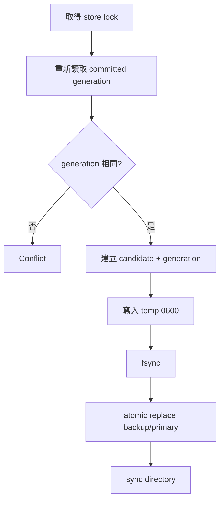

# 安全與持久化

## Threat model

Aster state 包含：

- VLESS UUID
- AnyTLS password
- Subscription token
- User identity
- Traffic counters

Admin API 可變更 runtime authentication。取得 state 或 Aster secret 的攻擊者等同取得帳號管理權，因此部署時應把 Aster 視為敏感 control plane。

## Secret 分離

```yaml
secret: "clash-controller-secret"

aster:
  secret: "independent-aster-secret-at-least-32-bytes"
```

| Secret | 保護範圍 |
| --- | --- |
| Controller `secret` | `/configs`、`/proxies`、`/rules` 等 Clash API |
| `aster.secret` | `/api/admin/*` |
| Subscription token | 單一 `/sub/aster/{token}` |

三者不可重用。

## Admin route 掛載規則

| Controller transport | Aster Admin |
| --- | --- |
| 明文 TCP + loopback bind | 掛載 |
| 明文 TCP + 非 loopback bind | 不掛載 |
| HTTPS Controller | 掛載 |
| Unix socket | 掛載 |
| Windows named pipe | 掛載 |

Subscription route 仍會掛在 Controller router 上，因為 remote client 需要存取。

## Same-origin

Admin middleware 會：

1. 拒絕 `Sec-Fetch-Site: cross-site`。
2. 若 request 有 `Origin`，要求 scheme/host 與 request 相同。
3. 只有 request 來自 loopback 時才採信第一個 `X-Forwarded-Proto`。

CLI request 通常沒有 `Origin`，仍需 Bearer token。

不要讓 public client 任意注入 `Host`、`Origin` 或 forwarded headers。Reverse proxy 應覆寫而非附加這些 header。

## Reverse proxy 建議

建議拆分：

```text
admin.example.com -> private/VPN -> Aster admin
proxy.example.com/sub/aster/* -> public HTTPS subscription
```

如果必須共用 origin：

- `/api/admin/*` 限制管理 IP、VPN 或 mTLS。
- `/sub/aster/*` 保持 public，但加 rate limit。
- 不把一般 `/configs`、`/proxies` 暴露到 Internet。
- Proxy 到 loopback Controller。
- 保留真實 HTTPS scheme，正確覆寫 `X-Forwarded-Proto`。

## Store 路徑與格式

預設：

```text
<home>/aster-state.json
<home>/aster-state.json.bak
<home>/aster-state.json.lock
```

State version 目前是 `1`，最大 16 MiB。

Primary 與 backup 都會驗證：

- 只接受 regular file。
- 拒絕 symlink。
- 大小不得超過限制。
- JSON version 必須支援。
- Listener/user/revision/token 結構必須有效。
- 檔案與 parent directory 權限必須安全。

若兩份都有效，使用 generation 較新者；若一份損壞，使用另一份並在後續 commit 修復 redundancy。

## Atomic commit

Mutation 流程：



這可避免多程序或 crash 留下半份 JSON，但無法取代外部備份。

## Unix permissions

Store parent directory 必須是 owner-only，state file 使用 `0600`。若既有檔案 owner 或 mode 不安全，載入會失敗。

建議：

```sh
install -d -m 700 /etc/mihomo
chmod 600 /etc/mihomo/aster-state.json*
```

不要把 state 放在所有使用者可讀的 shared volume。

## Windows ACL

Windows 會檢查並修正 owner、目前使用者、Administrators 與 SYSTEM 的 ACL。繼承自寬鬆 parent 的額外 principal 可能使驗證失敗。

使用 service account 執行時，請讓設定目錄由該 account 擁有，不要放在多人共用的可寫目錄。

## Backup

至少備份：

- `config.yaml`
- Certificates/private keys
- `aster-state.json`
- `aster-state.json.bak`
- 必要 providers/rules

State backup 必須與 config 中 listener names 一致。直接回復很舊的 state 可能撤銷新帳號或重新啟用舊 credentials；回復後先用隔離環境 `-t` 並檢查 admin snapshot。

## Subscription token

Subscription token：

- 儲存在 state。
- URL 中直接承載 access capability。
- Rotate 後舊 token 立即失效。
- 不應記錄在 access log、analytics、Referer 或聊天訊息。

Reverse proxy 可考慮：

```text
Cache-Control: no-store
Referrer-Policy: no-referrer
```

Aster 已設定 `Cache-Control: no-store`，proxy 不應覆寫成可快取。

## Operational checklist

- [ ] Controller secret 與 Aster secret 不同。
- [ ] Aster secret 至少 32 random bytes。
- [ ] Plain HTTP admin 只綁 loopback。
- [ ] Public side 只暴露必要 route。
- [ ] Store directory 及 files 權限正確。
- [ ] Backup 經過加密與存取控制。
- [ ] Reverse proxy 覆寫 Host/Origin/forwarded headers。
- [ ] Subscription URL 不進入 analytics/log。
- [ ] 409 conflict 由 client 正確處理。
- [ ] 定期測試 token rotation 與 disabled user。
- [ ] 確認 quota/expiration 不是由核心提供。
