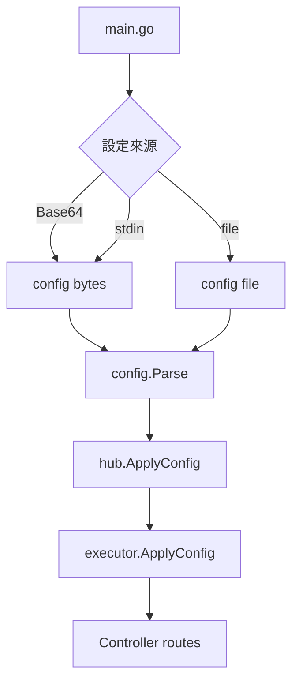
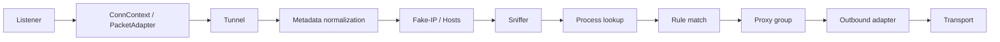
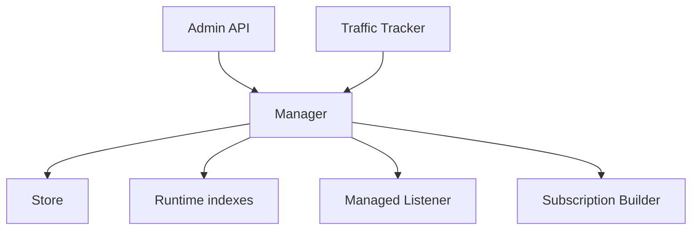

# 架構

## 啟動流程

`main.go`：

1. 解析 flags/env。
2. 處理 `convert-ruleset`、`generate`、`age` 子命令。
3. 設定 home、geodata、age keys。
4. 取得 config bytes 或 file。
5. `-t` 時只 parse。
6. 一般模式呼叫 `hub.Parse`。
7. 註冊 updater、post-up/down、signals。

## Apply config

`hub/executor` 的主要順序：

1. Lock config apply。
2. 暫停 tunnel。
3. 更新 CA、experimental、auth users。
4. 更新 proxies/providers。
5. 更新 rules、sniffer、hosts。
6. 更新 general、NTP、DNS。
7. Stage Aster managed listeners。
8. Patch listeners。
9. Configure Aster。
10. 更新 TUN、iptables、tunnels。
11. 載入 providers/profile/updater。
12. Reset resolver connections。
13. 恢復 running。

這不是完整 ACID transaction。部分 subsystem 已更新後仍可能遇到後續錯誤；Aster listener 路徑另採 fail-closed。

## Data plane

TCP 會建立 connection tracker；UDP 依 key hash 分配到 worker queue。Queue 滿時 UDP packet 可能被 drop，因此高流量環境需實測容量與延遲。

## Package map

| 路徑 | 責任 |
| --- | --- |
| `adapter/inbound` | 入站 connection/packet metadata adapters |
| `adapter/outbound` | Proxy outbound implementations |
| `adapter/outboundgroup` | Select、URL test、fallback、load balance |
| `adapter/provider` | Proxy providers 與 health checks |
| `common` | Generic collections、pool、network wrappers、sync |
| `component` | CA、dialer、resolver、geodata、sniffer、profile、updater |
| `component/aster` | Aster manager、users、traffic、store、subscriptions |
| `config` | YAML decode、defaults、validation |
| `constant` | Interfaces、metadata、paths、features |
| `dns` | DNS clients、server、policy、fake-IP integration |
| `hub` | Apply config 與 Controller |
| `listener` | General 與 named inbound servers |
| `rules` | Rule parsing/matching/providers |
| `transport` | Protocol/crypto/mux/obfuscation |
| `tunnel` | Central TCP/UDP routing data plane |

## Aster control plane

Manager 內同時維護：

- Locked mutable store。
- Atomic immutable runtime indexes。
- Managed listener set。
- Subscription token index。
- Traffic accumulator。

讀取 hot path 優先使用 atomic runtime snapshot，mutation 才進入 manager lock 與 store commit。

## Controller route groups

Router 先掛載：

- Aster subscription。
- 符合 policy 時的 Aster admin。

再建立一般 Controller auth group：

- `/configs`
- `/proxies`
- `/rules`
- `/connections`
- `/providers`
- `/cache`
- `/dns`
- `/storage`
- `/restart`
- `/upgrade`

最後掛載 `/ui` 與 optional DoH。因此三種 route 的 authentication boundary 不完全相同。

## Platform abstraction

Go build constraints 分隔：

- Listener/socket APIs。
- TUN。
- Process lookup。
- Memory statistics。
- Store lock/replace/security。
- Power events。
- Routing mark/reuse。

修改平台檔案時，至少要確保 Linux、Windows、macOS build。CI 的 macOS root tests 會排除部分 inbound tests，不能只靠單一 CI job 推論所有平台 runtime 行為。

## Shutdown

正常 shutdown：

- 暫停 tunnel。
- Flush Aster traffic。
- 關閉 listeners/TUN。
- 清理自動 iptables。
- 關閉 providers與 background services。
- 保存 fake-IP/cache。

Hard kill 無法保證最後一次 flush；部署應使用 SIGTERM 並給足 termination grace period。
