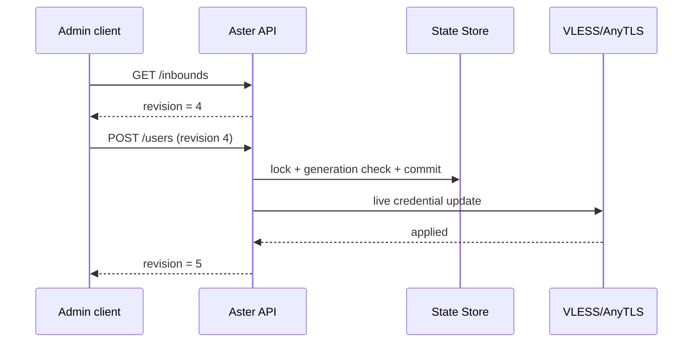

# Aster management overview

::: tip End-to-end operations
To actually walk through secrets, state, managed listeners, CRUD, 409 conflicts, subscription rotation, and backups, use [Manage users and subscriptions live](/en/tutorials/user-management).
:::

## The problem it solves

A traditional Mihomo server listener writes users in YAML. Changing credentials usually means editing the configuration and reloading the whole runtime. The Aster management layer turns VLESS and AnyTLS users into persistable, live-updated resources while keeping Mihomo’s existing data plane. The main protocol-layer exception is the [AnyTLS + REALITY](/en/reference/anytls-reality) support Aster added separately.

Aster provides:

- Named managed listeners.
- User create/read/update/delete.
- Enable/disable.
- Per-listener revision.
- Per-user traffic and active connections.
- Subscription URLs and token rotation.
- A hardened state store.
- Authentication independent of the Clash Controller.

## Enablement

You need three pieces:

1. At least one named VLESS or AnyTLS listener.
2. An `aster` block.
3. A Controller transport that can reach the API.

```yaml
external-controller: 127.0.0.1:9090
secret: "controller-secret"

listeners:
  - name: edge-vless
    type: vless
    listen: 0.0.0.0
    port: 8443
    users: []
    certificate: ./server.crt
    private-key: ./server.key

  - name: edge-anytls
    type: anytls
    listen: 0.0.0.0
    port: 9443
    users: {}
    certificate: ./server.crt
    private-key: ./server.key

aster:
  secret: "replace-with-a-random-secret-at-least-32-bytes"
  public-base-url: https://proxy.example.com
  store: aster-state.json
  managed-listeners:
    - edge-vless
    - edge-anytls
```

## Configuration fields

| Field | Required | Meaning |
| --- | --- | --- |
| `secret` | yes | Admin Bearer token, at least 32 bytes, no leading/trailing space |
| `public-base-url` | no | Public subscription origin; must be an absolute HTTPS URL |
| `store` | no | State path, default `aster-state.json` |
| `managed-listeners` | no | Named VLESS/AnyTLS listeners to take over |

`public-base-url` cannot contain:

- User information
- Query
- Fragment
- A non-HTTPS scheme

A trailing `/` is normalized away.

## Startup sync

On start the manager:

1. Validates Aster config and managed listener types.
2. Loads the primary and `.bak` store.
3. Chooses the valid state with the newer generation.
4. Maps YAML configured users onto state.
5. Applies managed credentials before the listener accepts connections.
6. Sets up the traffic observer.

If state cannot be loaded safely or applying managed users fails, managed listeners fail closed so stale credentials are not accidentally served.

## Revision model

Each listener state includes:

```json
{
  "revision": 4,
  "applied_revision": 4
}
```

- `revision`: the committed durable state.
- `applied_revision`: the state already applied to the listener runtime.
- `pending`: the two differ.

Every mutation must carry the current revision so lost updates are avoided.

Typical flow:



If another client wrote first, the request gets `409 Conflict`. The admin client should reread instead of blindly retrying the old payload.

## Traffic model

After a connection authenticates, Aster creates:

```text
Principal{Inbound, UserID}
```

Aster aggregates for that principal:

- Upload bytes
- Download bytes
- Active connections
- Traffic generation

Resetting traffic increments the generation so an in-flight snapshot from before the reset is not counted again.

## Subscription

A subscription URL is returned only when `public-base-url` is set. The public hostname becomes the proxy-link server. The port comes from the listener’s actual listen address.

Eligible:

- VLESS TCP, WS, gRPC, and basic XHTTP.
- VLESS TLS/REALITY.
- AnyTLS TLS/REALITY.

Not eligible:

- Disabled users.
- Unmanaged listeners.
- No usable port or credential.
- ShadowTLS, ResTLS, JLS.
- Advanced XHTTP placement/padding.

Next:

- [Admin API request/response](/en/aster/api)
- [Security, store, and reverse proxy](/en/aster/security)
