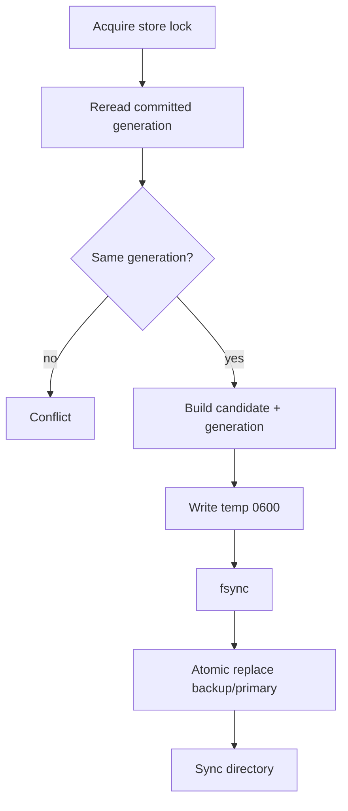

# Security and persistence

## Threat model

Aster state contains:

- VLESS UUIDs
- AnyTLS passwords
- Subscription tokens
- User identity
- Traffic counters

The Admin API can change runtime authentication. An attacker who gets state or the Aster secret has account-management power, so treat Aster as a sensitive control plane when you deploy it.

## Separate secrets

```yaml
secret: "clash-controller-secret"

aster:
  secret: "independent-aster-secret-at-least-32-bytes"
```

| Secret | Protects |
| --- | --- |
| Controller `secret` | Clash APIs such as `/configs`, `/proxies`, `/rules` |
| `aster.secret` | `/api/admin/*` |
| Subscription token | A single `/sub/aster/{token}` |

Do not reuse the three.

## Admin route mount rules

| Controller transport | Aster Admin |
| --- | --- |
| Plaintext TCP + loopback bind | Mounted |
| Plaintext TCP + non-loopback bind | Not mounted |
| HTTPS Controller | Mounted |
| Unix socket | Mounted |
| Windows named pipe | Mounted |

The subscription route is still mounted on the Controller router because remote clients need it.

## Same-origin

Admin middleware:

1. Rejects `Sec-Fetch-Site: cross-site`.
2. If the request has `Origin`, requires the scheme/host to match the request.
3. Trusts the first `X-Forwarded-Proto` only when the request comes from loopback.

CLI requests usually have no `Origin` and still need a Bearer token.

Do not let a public client inject arbitrary `Host`, `Origin`, or forwarded headers. The reverse proxy should overwrite those headers, not append them.

## Reverse-proxy recommendations

Prefer a split:

```text
admin.example.com -> private/VPN -> Aster admin
proxy.example.com/sub/aster/* -> public HTTPS subscription
```

If you must share an origin:

- Restrict `/api/admin/*` to admin IPs, VPN, or mTLS.
- Keep `/sub/aster/*` public, but add a rate limit.
- Do not expose ordinary `/configs` or `/proxies` to the Internet.
- Proxy to the loopback Controller.
- Preserve the real HTTPS scheme and overwrite `X-Forwarded-Proto` correctly.

## Store path and format

Default:

```text
<home>/aster-state.json
<home>/aster-state.json.bak
<home>/aster-state.json.lock
```

State version is currently `1`, maximum 16 MiB.

Both primary and backup are validated:

- Only regular files are accepted.
- Symlinks are rejected.
- Size must stay under the limit.
- JSON version must be supported.
- Listener/user/revision/token structure must be valid.
- File and parent-directory permissions must be safe.

If both copies are valid, the newer generation is used. If one is damaged, the other is used and a later commit can restore redundancy.

## Atomic commit

Mutation flow:



This avoids half-written JSON after a multi-process crash, but it does not replace external backups.

## Unix permissions

The store parent directory must be owner-only. State files use `0600`. An existing file with an unsafe owner or mode fails to load.

Recommended:

```sh
install -d -m 700 /etc/mihomo
chmod 600 /etc/mihomo/aster-state.json*
```

Do not put state on a shared volume readable by every user.

## Windows ACL

Windows checks and corrects ACLs for the owner, the current user, Administrators, and SYSTEM. Extra principals inherited from a loose parent can make validation fail.

When you run as a service account, let that account own the configuration directory. Do not put it in a multi-user writable directory.

## Backup

At least back up:

- `config.yaml`
- Certificates/private keys
- `aster-state.json`
- `aster-state.json.bak`
- Required providers/rules

A state backup must match the listener names in the config. Restoring a very old state can revoke new accounts or re-enable old credentials. After restore, run `-t` in an isolated environment and check an admin snapshot first.

## Subscription tokens

A subscription token:

- Is stored in state.
- Carries access capability directly in the URL.
- Invalidates the old token immediately when rotated.
- Should not be recorded in access logs, analytics, Referer, or chat.

The reverse proxy can consider:

```text
Cache-Control: no-store
Referrer-Policy: no-referrer
```

Aster already sets `Cache-Control: no-store`. The proxy should not overwrite that into something cacheable.

## Operational checklist

- [ ] Controller secret and Aster secret are different.
- [ ] Aster secret is at least 32 random bytes.
- [ ] Plain HTTP admin is loopback only.
- [ ] The public side exposes only the necessary routes.
- [ ] Store directory and file permissions are correct.
- [ ] Backups are encrypted and access-controlled.
- [ ] The reverse proxy overwrites Host/Origin/forwarded headers.
- [ ] Subscription URLs do not enter analytics/logs.
- [ ] Clients handle 409 conflicts correctly.
- [ ] Token rotation and disabled users are tested regularly.
- [ ] Confirm quota/expiration is not provided by the core.
