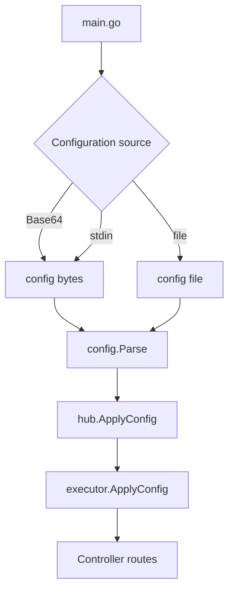
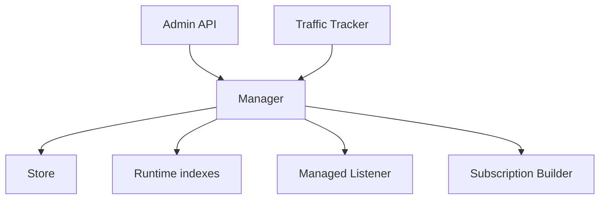

# Architecture

## Startup

`main.go`:

1. Parse flags/env.
2. Handle `convert-ruleset`, `generate`, and `age` subcommands.
3. Set home, geodata, and age keys.
4. Obtain config bytes or a file.
5. On `-t`, only parse.
6. In normal mode call `hub.Parse`.
7. Register updater, post-up/down, and signals.

## Apply config

The main `hub/executor` order is:

1. Lock config apply.
2. Pause the tunnel.
3. Update CA, experimental, and auth users.
4. Update proxies/providers.
5. Update rules, sniffer, hosts.
6. Update general, NTP, DNS.
7. Stage Aster managed listeners.
8. Patch listeners.
9. Configure Aster.
10. Update TUN, iptables, tunnels.
11. Load providers/profile/updater.
12. Reset resolver connections.
13. Resume running.

This is not a full ACID transaction. Later errors can still happen after some subsystems have already updated. The Aster listener path is separately fail-closed.

## Data plane

TCP creates a connection tracker. UDP is hashed by key onto a worker queue. When the queue is full, UDP packets may be dropped, so busy environments need a real capacity and latency test.

## Package map

| Path | Responsibility |
| --- | --- |
| `adapter/inbound` | Inbound connection/packet metadata adapters |
| `adapter/outbound` | Proxy outbound implementations |
| `adapter/outboundgroup` | Select, URL test, fallback, load balance |
| `adapter/provider` | Proxy providers and health checks |
| `common` | Generic collections, pools, network wrappers, sync |
| `component` | CA, dialer, resolver, geodata, sniffer, profile, updater |
| `component/aster` | Aster manager, users, traffic, store, subscriptions |
| `config` | YAML decode, defaults, validation |
| `constant` | Interfaces, metadata, paths, features |
| `dns` | DNS clients, server, policy, fake-IP integration |
| `hub` | Apply config and Controller |
| `listener` | General and named inbound servers |
| `rules` | Rule parsing/matching/providers |
| `transport` | Protocol/crypto/mux/obfuscation |
| `tunnel` | Central TCP/UDP routing data plane |

## Aster control plane

The manager keeps:

- A locked mutable store.
- Atomic immutable runtime indexes.
- The managed listener set.
- A subscription-token index.
- A traffic accumulator.

Read hot paths prefer the atomic runtime snapshot. Mutations enter the manager lock and store commit.

## Controller route groups

The router first mounts:

- Aster subscriptions.
- Aster admin when policy allows.

Then it creates the ordinary Controller auth group:

- `/configs`
- `/proxies`
- `/rules`
- `/connections`
- `/providers`
- `/cache`
- `/dns`
- `/storage`
- `/restart`
- `/upgrade`

Finally it mounts `/ui` and optional DoH. The three route groups therefore do not share the same authentication boundary.

## Platform abstraction

Go build constraints split:

- Listener/socket APIs.
- TUN.
- Process lookup.
- Memory statistics.
- Store lock/replace/security.
- Power events.
- Routing mark/reuse.

When you change platform files, at least keep Linux, Windows, and macOS building. CI macOS root tests exclude some inbound tests, so one CI job is not enough to infer every platform’s runtime behavior.

## Shutdown

A graceful shutdown:

- Pauses the tunnel.
- Flushes Aster traffic.
- Closes listeners/TUN.
- Cleans automatic iptables.
- Closes providers and background services.
- Saves fake-IP/cache.

A hard kill cannot guarantee the last flush. Deployments should use SIGTERM and give a long enough termination grace period.
