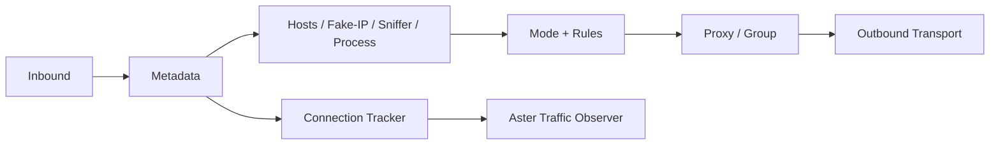

# 專案介紹

## Aster Core 是什麼

Aster Core 是 Mihomo 相容的通用代理核心。它可作為本機代理、透明代理、TUN gateway、協定 client、協定 server，以及具 REST API 的可管理服務。

專案由兩個層次組成：

1. **Mihomo 基線能力**：YAML 設定、Clash API、DNS、規則、代理群組、providers、TUN、入站、出站及 transport。
2. **Aster 新增能力**：AnyTLS + REALITY 用戶端／伺服器、VLESS/AnyTLS 使用者管理、逐 principal 流量、revision、安全 state store、訂閱與相容封裝。

理解這個邊界很重要。看到 Aster 支援 VMess、Hysteria、WireGuard 或 TUN，不代表這些都是 Aster 新增；大多數協定能力來自 Mihomo。Aster 的主要差異集中在伺服器管理面，另有明確的資料平面擴充：[AnyTLS + REALITY](/reference/anytls-reality)。

## 適用情境

- 需要沿用現有 Mihomo profile、rules、providers 或 Dashboard。
- 想在單一核心同時提供 client 與 server 入站能力。
- 需要部署 AnyTLS + REALITY server 或使用 Aster 作為對應 client。
- 需要即時管理 VLESS 或 AnyTLS 帳號，不想每次都重載完整設定。
- 需要逐使用者流量與活動連線資訊。
- 需要讓管理狀態具備檔案鎖、衝突檢查與安全權限。
- 在 OpenWrt/Nikki 使用自訂核心，但仍要保留 `/usr/bin/mihomo` 相容入口。

## 不適用情境

- 需要直接讀取 sing-box 或 Xray JSON。
- 需要透過 Aster API 管理 VLESS、AnyTLS 以外的入站協定。
- 需要內建 quota、到期日、付款或完整面板功能。
- 需要 `type: relay` 代理群組；此類群組已移除，應改用 `dialer-proxy` chain。

## 核心資料流

入站封包或連線會轉成 metadata，經過 fake-IP 還原、hosts、協定嗅探與程序查找，再依 Direct、Global 或 Rule mode 選擇出站。連線 tracker 負責全域統計；當 Aster 啟用時，也會把有 principal 的流量送到 Aster manager。

## 相容性承諾

Aster 保留：

- Mihomo YAML 頂層設定及主要欄位。
- Clash-compatible Controller API。
- `Mihomo Meta` 版本輸出前綴，供 Nikki 偵測。
- 標準 proxy、proxy group、provider 與 rule provider 行為。

相容不代表所有上游版本永久一致。Aster 目前固定以文件首頁列出的 commit 為基線，上游更新需經過明確 merge，並保留 Aster 管理、安全及互通測試。

下一步可從[快速開始](/guide/getting-started)建立第一份設定，或直接閱讀[與 Mihomo 的差異](/reference/mihomo-differences)。
