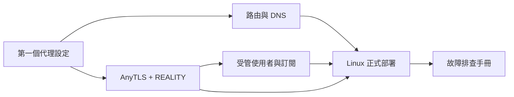

# 實戰教學

這一區不是欄位字典，而是可以從頭照做的操作路線。每篇都會先說明目標與前置條件，再提供完整設定、執行指令、驗證方式及失敗時的檢查順序。

::: warning 先替換範例值
教學中的 `<SERVER_IP>`、`<SERVER_PUBLIC_KEY>`、`<ASTER_SECRET>` 等字串都是 placeholder。不要原樣部署，也不要把正式 private key、密碼、UUID、API token 或訂閱網址提交到 Git。
:::

## 建議學習路線

### 第一次使用 Aster Core

1. [建立第一個可用代理設定](/tutorials/first-proxy)
2. [路由與 DNS 分流實戰](/tutorials/routing-dns)

這條路線會先完成本機 mixed proxy、遠端 outbound、proxy group、DNS 與規則，並以 `curl`、Controller API 和 log 確認流量真正走到預期出口。

### 自架 AnyTLS + REALITY

1. [從零部署 AnyTLS + REALITY](/tutorials/anytls-reality)
2. [即時管理使用者與訂閱](/tutorials/user-management)
3. [Linux VPS 正式上線](/tutorials/linux-production)

這條路線涵蓋 server/client 兩端、REALITY 金鑰與 short ID、連接埠與時鐘檢查、Aster state、revision 衝突、訂閱輪替、systemd、更新與回退。

### 已經上線，現在發生問題

直接使用[故障排查手冊](/tutorials/troubleshooting)。先依症狀縮小到設定、socket、DNS、REALITY、Controller、Aster state 或 UDP，再收集已遮罩的診斷資料。

## 教學與參考文件的分工

| 你要做的事 | 使用教學 | 查欄位細節 |
| --- | --- | --- |
| 建立可連線的 client profile | [第一個代理設定](/tutorials/first-proxy) | [出站與代理群組](/reference/outbounds) |
| 做國內外、服務或網域分流 | [路由與 DNS](/tutorials/routing-dns) | [規則與 DNS](/reference/routing-dns) |
| 自架 AnyTLS + REALITY | [AnyTLS + REALITY 教學](/tutorials/anytls-reality) | [AnyTLS + REALITY 參考](/reference/anytls-reality) |
| 管理 VLESS/AnyTLS 帳號 | [使用者管理教學](/tutorials/user-management) | [Admin API](/aster/api) |
| 在 VPS 長期執行 | [Linux 正式部署](/tutorials/linux-production) | [Linux 與 systemd](/deployment/linux) |
| 服務無法啟動或連線 | [故障排查手冊](/tutorials/troubleshooting) | [疑難排解參考](/troubleshooting) |

## 安全原則

- 先用 `aster-core -t` 驗證，再 reload 或 restart。
- Controller 與 Aster Admin API 預設只綁 loopback，對外管理時放在有認證的 HTTPS reverse proxy 或 VPN 後面。
- 每個環境使用獨立的 REALITY private key、使用者 credential、Controller secret 與 Aster secret。
- 修改前備份 YAML、Aster state 及 `.bak`；更新 binary 時保留上一版，驗證失敗即可回退。
- 分享 log、設定或 API response 前，遮罩 server IP、UUID、password、private/public key、short ID、token 及訂閱 URL。
